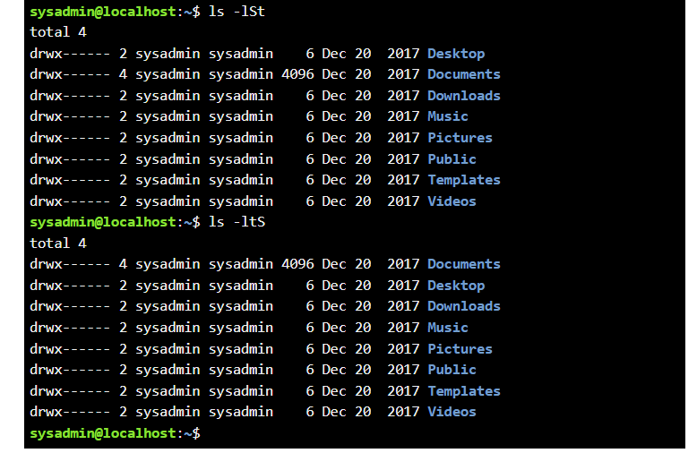

**DAY 3**
#### Some basic sorting commands 

- `-ls` - sorted in alphabetic order by default 
- `-t` - will sort items by timestamps. 
- `-S` - will sort by size. see its capital
- `-r` - will reverse the order of any kind of sort

> I got curious, what will happen if i combine two sorting at once. 
> `ls -St` 
> found out In this case, Last command wins... 
> so It'll print items sorted by time modified.

