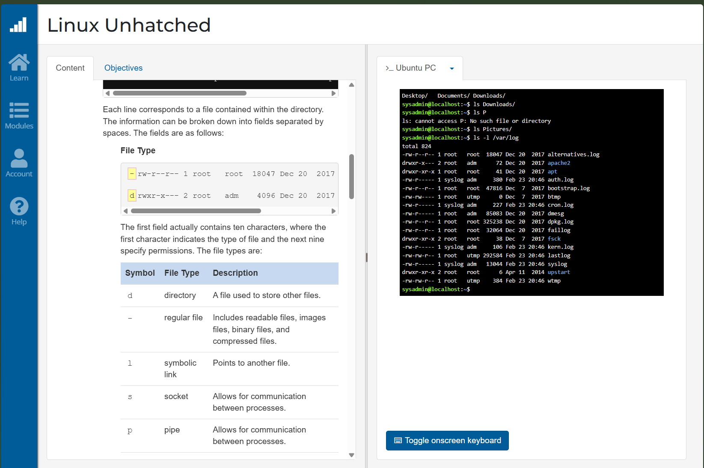

 **DAY 1**
### Basic Commands 

#### `ls` - Listing content 

> Commands can have arguments 
> for eg: 
> `ls -l` will list items with more information (long)
> `ls -r` will reverse the command output

> We can also chain arguements in the following manner
> `ls -l -r` - will reverse print the items in a long format
> `ls -lr` - will do the same

#### `pwd` - print currant working directory

#### cd - change working directory

> `/` means ROOT directory 
> we can use "absolute path to change to a different directory using the `cd"
> an absolute path always starts with `/`. 

> when changing directory inside currant directory you don't need to use / 
> `cd downloads/abc.text`

> `cd ..` is going to move you to  directory higher relative to the current directory.
> `.` this characrer represents your currant directory 
> `cd ~` this will bring you to your home dir.  

**DAY 2**

- from left to right 

> In the listing files , there are total 10 characters. 
> First one is showing the file type. 

> Next nine characters are permissions - how certain users can access a file. 

> at the last there is a number which is known as [[Hard-Link-Count]] - This number indicates how many hard links point to this file

> next to 10 characters, it is the Owner - who owns the particular file. 
> Every time a file is created, the ownership is automatically assigned to the user who created it.

> Next to user owner, there is Group owner. which group owns the file

> 5 th Item is Flie size in KB.

> Next is time stamp - Last time the file was modified 

> lastly file name

**Day 3**

---
[[Linux-Commands]]
